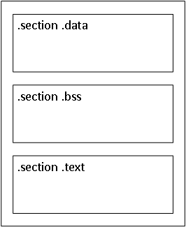

# 第4章 汇编语言程序范例

准备好所有开发工具之后，就可以开始学习汇编语言程序设计了。汇编语言桯序使用通用模板和格式（是使用的汇编器特定的），可以把它们用于所有应用程序的开发。

本章引导读者学习GNU汇编器的基本汇编语言程序模板。本章的第一节介绍汇编语言程序
中的通用项目，以及如何使用它们定义通用模板。下一节讲解－个范例程序，以及如何汇编和运行它。接下来将学习如何使用GNU调试器调试范例程序。本章的最后一节演示如何把C库函数井人汇编诘言程序中。

## 程序的组成

正如第1章“什么是汇编语言”中介绍的，汇编语言程序由定义好的段构成，每个段都有不
同的目的。三个最常用的段如下：
* 数据段
* bss段
* 文本段

所有礼编语言程序中都必须有文本段。这里是在可执行程序内声明指令码的地方。数据和
bss段是可选的，但是在程序中经常使用。数据段声明带有初始值的数据元素。这些数据元素用作汇编语言程序中的变量。bss段声明使用零（或者null) 值初始化的数据元素。这些数据元素最常用作汇编语言程序中的缓冲区。

下面几节介绍如何在为GNU汇编器编写的汇编语言程序中声明不同的段，GNU汇编器是本书中使用的汇编器。

### 定义段

GNU汇编器使用`.section`命令语旬声明段。`.section`语句只使用一个参数————它声明的段的类型。图4-1显示汇编语言程序的布局。

图4-1演示在程序中安排段的一般方式。bss段总是应该安/排在文本段之前，但是数据段可以移动到文本段之后，虽然这不是标准。除了完成功能性的要求之外，编写的汇编语言程序
还应该容易阅读。将所有数据定义集中在源代码的开头使其他程序员更加容易接手你的工作井且理解它。



### 定义起始点

当汇编语言程序被转换为可执行文件肘，连接器必须知道指令码中的起始点是什么。对于只有单一指令路径的简单程序， 找到起始点通常不是问题。但是，对干使用分散在源代码各个位置的若干函数的更加复杂的程序，发现程序从哪里开始可能是个问题。

为了解决这个问题， GNU汇编器声明一个默认标签，或者说标识符，它应该用作应用程序的入口点。`_start`标签用于表明程序应该从这条指令开始运行。如果连接器找不到这个标签，它会生成错误消息：

```shell
$ ld bad-test.o -o bad-test
ld: warning: cannot find entry symbol _start; defaulting to 0000000000008054
```

就像链接器的输出显示的，如果链接器找不到`_start`标签，它就会试图查找程序的起始点，但是对于复杂的程序，不能保证链接器能正确地作出猜测。

也可以使用`_start`之外的其他标签作为起始点。可以使用链接器的`-e` 参数定义新的起始点的名称。

除了在应用程序中声明起始标签之外，还苦要为外部应用程序提供人口点。这是使用`.global`命令完成的。

`.global`命令声明外部程序可以访问的程序标签。如果编写被外部汇编语言或者C语言程序使用的一组工具，就应该使用`.global`命令声明每个函数段标签。

了解了这些信息，就可以为所有汇编语言程序创建基础模板。模板应该像下面这样：

```asm
.section .data

    <initialized data here>

.section .bss

    <uninitialized data here>

.section .text
.global _start
_start:

    <nstruction code goes here>
```

有了这样的模板，就准备好了开始编写汇编语言程序。下一节讲解一个范例应用程序，它展示如何从汇编语言程序源代码构建应用程序。

## 创建简单程序

现在是创建简单的汇编语言应用程序来演示这些组件如何结合在一起使用的时候了。最开
始，我们创建一个`hello world`的简单应用程序，即在终端打印一行字符串。

### 范例程序

这个程序是一个简单的应用程序，它仅仅向终端打印一行字符串。下面就是范例程序`hello_syscall.s`：

[hello_syscall.s](code/sample/hello_syscall.s ':include')

这个程序使用了许多不同的汇编语言指令。现在，不必过于担心这些语句是什么；以后的章节中将详细地讲解它们。目前请把注意力集中在如何在程序中安排指令、指令如何操作的流程以及源代码文件如何转换为可执行程序文件上。这样就不会给自己造成混乱，下面是对源代码如何工作的简要讲解。

首先，在数据段中声明了一个字符串：

```asm
.section .data
hello:
    .asciz	"hello, arm\n"
```

`.asciz`声明使用ASCII字符声明－个文本字符串，末尾会自动加上一个空字符。字符串元素被预定义并且放在内存中，其起始内存位置由标签`hello`指示。

读者应该认识程序模板中接下来的段落。它声明程序的指令码段和一般的起始标签：

```asm
.section .text
.global	_start
_start:
```

 程序首先将字符串`hello, arm\n`输出到控制台。

 ```asm
    mov r0, #1      // 文件描述符，1是标准输出
    ldr r1, =hello  // 字符串首地址
    mov r2, #12     // 字符串长度
    mov r7, #4      // write()的调用号是4，通过r7寄存器传递
    swi #0x0        // 触发系统调用
 ```

这个程序使用一个Linux系统调用(swi #0x0) 从Linux内核访问控制台显示。Linux内核提供了很多可以很容易地从汇编应用程序访问的预置函数。为了访问这些内核函数，必须使用`swi`指令码，它生成具有`0x0`值的软件中断。执行的具体函数由`r7`寄存器的值来确定。如果没有这个内核函数，就必须自己把每个输出字符发送到正确的显示器I/0地址。Linux系统调用为汇编语言程序员节省了大量时间。

Linux的`write`系统调用用于把字节写人文件。下面是`write`系统调用的参数：
* r7包含系统调用值。
* r0包含要写人的文件描述符。
* r1包含字符串的开头。
* r2包含字符串的长度。

如果读者熟悉UNIX, 就会知道几乎所有东西都被作为文件处理。标准输出（STDOUT）表示当前会话的显示终端，它的文件描述符为1。写人到这个文件描述符将在控制台屏幕上显示信息。

要显示的字节采用从之读取信息的内存位置以及要显示的字节数量的形式进行定义。r1寄存器加载的是hello标签的内存位置，它定义字符串的开头。因为输出字符串的长度总是相同的．所以可以在r2寄存器中硬编码长度值。

显示了字符串之后，就该干净地退出程序了。同样，Linux系统调用能够提供帮助。通过使用系统调用1（退出函数），程序被正确地终止，并且返回到命令提示符。r0寄存器包含程序返回给shell的退出代码值。可以使用r0寄存器的内容，按照汇编语言程序内的情况在shell脚本程序中生成不同的结果。零值表示程序成功地执行了。这里使用了一个区别于0的数字42。

```asm
    mov r0, #42     // 退出码
    mov r7, #1      // exit()的调用号是1
    swi #0x0        // 触发系统调用
```

### 构建可执行程序

有了保存为`hello_syscall.s`的汇编语言源代码程序，可以使用GNU汇编器和GNU连接器构建可执行程序，方法如下：

```shell
$ as -o hello_syscall.o hello_syscall.s
$ ld -o hello_syscall hello_syscall.o
```

这些命令的输出没有什么令人过于兴奋的（当然，除非代码中出现了一些打字错误）。第一个步骤使用as命令把汇编语言源代码汇编为目标代码文件`hello_syscall.o`。第二个步骤使用ld把目标代码文件链接为可执行文件hello_syscall。

### 运行可执行程序

连接器生成可执行程序文件之后，就可以运行它了。下面是在我的开发板上程序愉出的例子：

```shell
$ ./hello_syscall
hello, arm
$ echo $?
42
```

非常好！桯序按照预期运行！并且程序的返回码也是预期的42。

### 使用编译器进行汇编

因为GNU通用编译器（GNU Common Compiler, gcc）使用GNU汇编器编译C代码，所以也可以使用它在单一步骤内汇编和链接汇编语言程序。虽然这不是常用的方法，但是在必要的时候也是有用的。

使用gcc汇编程序时有一个问题. GNU连接器查找_start标签以便确定程序的开始位置．但是gcc查找的是main标签（读者也许已经通过C或者C++程序设计了解了它）。必须把程序中的_start标签和定义标签的global命令都改成下面这样：

```asm
.section .text
.global main
main:
```

改动之后，汇编和链接程序就没什么问题了：

```shell
$ gcc -o hello_syscall hello_syscall.s
$ ./hello_syscall
hello, arm
```

## 调试程序

在这个简单的例子中，除非在源代码中出现了一些打字错误，否则程序应该正确运行并且输出期望的结果。不幸的是，在汇编语言程序设计的工作中情况不总是如此。

在更加复杂的程序中，在给寄存器和内存位置赋值或者试图使用特定指令码处理复杂数据事务时，很容易犯错误。发生错误时，可以使用便利的调试器单步运行程序井且监视数据是如何被处理的。

本节介绍如何使用GNU调试器梒查范例程序，监视处理过程中寄存器和内存位置是如何改变的。

### 使用gdb

为了调试汇编语言程序，首先必须使用`-gstabs`参数汇编源代码：

```shell
$ as -gstabs -o hello_syscall.o hello_syscall.s
$ ld -o hello_syscall hello_syscall.o
```

第一次汇编源代码时，汇编过程没有发出错误或者警告消息。通过指定`-gstabs`参数，附加的信息被汇编进可执行程序文件中，以便帮助`gdb`检查源代码。虽然使用`-gstabs`参数创建的可执行程序的运行和行为依然和原始的程序一样，但是使用`-gstab`并不是明智的做法，除非确实要调试应用程序。

因为`-gstabs`参数在可执行程序文件中添加了附加信息，所以产生的文件比仅仅运行应用程序所需的文件要大一些。对于这个范例程序，不使用`-gstabs`参数进行汇编会生成下面的文件：

```shell
-rwxr-xr-x 1 root root 913 Aug 29 20:52 hello_syscall
```

使用`-gstabs`参数进行汇编时．程序文件变成下面这样：

```shell
-rwxr-xr-x 1 root root 1177 Aug 29 20:53 hello_syscall
```

注意，文件长度从913字节变成了1177字节。虽然对这个例子来说区别不大，但是想像一下如果汇编语言程序有10000行会怎么样！再次强调，如果并非必要，就最好不使用调试信息。

#### 单步运行程序

既然可执行程序文件已经包含了必要的调试信息，可以在gdb内运行它：

```shell
$ gdb hello_syscall
GNU gdb (GDB) Red Hat Enterprise Linux 7.6.1-120.el7
Copyright (C) 2013 Free Software Foundation, Inc.
License GPLv3+: GNU GPL version 3 or later <http://gnu.org/licenses/gpl.html>
This is free software: you are free to change and redistribute it.
There is NO WARRANTY, to the extent permitted by law.  Type "show copying"
and "show warranty" for details.
This GDB was configured as "armv7hl-redhat-linux-gnueabi".
For bug reporting instructions, please see:
<http://www.gnu.org/software/gdb/bugs/>...
Reading symbols from /root/armv7-asm/hello_syscall...done.
(gdb)
```

GNU调试器启动，把程序加载到内存中。可以使用run命令从gdb内运行程序：

```shell
(gdb) run
Starting program: /root/armv7-asm/hello_syscall
hello, arm
[Inferior 1 (process 3647) exited with code 052]
```

从输出可以看出，程序在调试器内的运行情况和从命令行运行是一样的。这并不特别令人兴奋。现在应该在程序启动时停止它，并且一步步地调试源代码的的每一行。

为了进行单步调试，必须设置断点（breakpoint）。断点放置在程序代码中希望调试器停止运行程序并且查看运行情况的位置。设置断点时可以使用几个不同的选项。你可以选择在下列任何情况下停止程序的执行：
* 到达某个标签
* 到达源代码中的某个行号
* 数据值到达特定值时
* 函数执行了指定的次数之后

对于这个简单的例子，我们把断点设置在指令码的开头，井且在源代码的处理过程中监视程序的运行情况。

在汇编语言程序中指定断点时，必须指定对于最近的标签的相对位置。因为这个范例程序在指令码段中只有一个标签，所以每个断点都必须依据_start指定。break命令的格式是：

```shell
break * label+offset
```

其中label是被引用的源代码中的标签，offset是执行应该停止的地方距离这个标签的行数。为了在第一条指令处设置断点，然后启动程序，应该使用下面的命令：

```shell
(gdb) break *_start
Breakpoint 1 at 0x8074: file hello_syscall.s, line 8.
(gdb) run
Starting program: /root/armv7-asm/hello_syscall

Breakpoint 1, _start () at hello_syscall.s:8
8           mov r0, #1      // 文件描述符，1是标准输出
(gdb)
```

非常好！程序开始启动，然后暂停在第一条指令码处。现在可以使用next或者step命令单步调试程序：

```shell
(gdb) next
9           ldr r1, =hello  // 字符串首地址
(gdb) next
10          mov r2, #12     // 字符串长度
(gdb) step
11          mov r7, #4      // write()的调用号是4，通过r7寄存器传递
(gdb) step
12          swi #0x0        // 触发系统调
(gdb)
```

每个next或者step命令会执行下一行源代码（并且显示行号是什么）。查看过感兴趣的段落之后，可以使用cont命令使程序按照正常的方式继续运行：

```shell
(gdb) cont
Continuing.
hello, arm
[Inferior 1 (process 7255) exited with code 052]
(gdb)
```

调试器从程序停止的地方继续执行并且按照正常的方式运行完程序。虽然缓慢地单步调试程序是不错的，但是更好的是能够随着调试的进行检查数据元素。调试器为完成这样的任务提供了方法，下一节将具体讲解。

#### 查看数据

虽然已经知道了如何在特定的位置停止程序，现在是在每次停止时检查数据元素的时候了。有几个不同的gdb命令用于检查不同类型的数据元素。两种最常被梒查的数据元素是用于变量的寄存器和内存位置。下表列出了用于显示这些信息的命令。

| 数据命令 | 描述 |
| - | - |
| info registers | 显示所有寄存器的值 |
| print | 显示特定寄存器或者来自程序的变量的值 |
| x | 显示特定内存位置的内容 |

使用`info registers`命令查看指令如何影响所有寄存器是很方便的：

```shell
(gdb) s
9           ldr r1, =hello  // 字符串首地址
(gdb) info registers
r0             0x1      1
r1             0x0      0
r2             0x0      0
r3             0x0      0
r4             0x0      0
r5             0x0      0
r6             0x0      0
r7             0x0      0
r8             0x0      0
r9             0x0      0
r10            0x0      0
r11            0x0      0
r12            0x0      0
sp             0x7efff6e0       0x7efff6e0
lr             0x0      0
pc             0x8078   0x8078 <_start+4>
cpsr           0x10     16
(gdb) s
10          mov r2, #12     // 字符串长度
(gdb) info registers
r0             0x1      1
r1             0x10098  65688
r2             0x0      0
r3             0x0      0
r4             0x0      0
r5             0x0      0
r6             0x0      0
r7             0x0      0
r8             0x0      0
r9             0x0      0
r10            0x0      0
r11            0x0      0
r12            0x0      0
sp             0x7efff6e0       0x7efff6e0
lr             0x0      0
pc             0x807c   0x807c <_start+8>
cpsr           0x10     16
```

输出显示，在`ldr r1, =hello`指令执行之前，`r1`寄存器是0，指令执行之后，`r1`寄存器包含字符串`hello`的地址。

print命令也可以用于显示各个寄存器的值．加上一个修饰符就可以修改print命令输出格式：
* print/d 显示十进制的值
* print/t 显示二进制的值
* print/x 显示十六进制的值

下面是print命令的一个例子：

```shell
(gdb) print/x $r1
$1 = 0x10098
(gdb) print/x $pc
$2 = 0x807c
(gdb)
```

x命令用于显示特定内存位置的值。和print命令类似，可以使用修饰符修改x命令的输出。x命令的格式是`x/nyz`。其中n是要显示的字符数，y是输出格式，它可以是：
* c 用于字符
* d 用于十进制
* x 用于十六进制
* i 用于指令

z是要显示的字段的长度：
* b 用于字节
* h 用于16位字（半字）
* w 用于32位字

下面的例子使用x命令显示位于hello标签的内存位置的值：

```shell
(gdb) x/12cb &hello
0x10098:        104 'h' 101 'e' 108 'l' 108 'l' 111 'o' 44 ','  32 ' '  97 'a'
0x100a0:        114 'r' 109 'm' 10 '\n' 0 '\000'
(gdb)
```

这个命令以字符模式（它也显示十进制值）显示hello变量（＆符号用于表明它是一个内存位置）的前12个字节。当跟踪对内存位置进行操作的指令时，这一特性的价值是无法衡量的。

## 在汇编语言中使用C库函数

`hello_syscall.s`程序使用Linux系统调用在控制台显示`hello, arm`字符串。还有不使用系统调用实现这个功能的其他方法。一种方法是使用C程序员非常熟悉的标准C库函数。很容易获得这些资源来利用很多通用的C函数。

本节介绍如何在汇编语言程序中使用C库函数。首先介绍通用的C函数printf, 还有使用printf函数的`hello_syscall.s`程序的新版本。然后，下一节讲解如何汇编和链接使用C库函数的程序。

### 使用printf

原始的`hello_syscall.s`程序使用Linux系统调用显示程序结果。如果系统上安装了`GNU C`编译器，就可以很容易地使用可能早已熟悉的通用C函数。

C库包含C程序通用的很多函数，比如printf和exit。对于程序的这个版本， Linux系统调用被替换为等同的C库调用。下面是`hello_glibc.s`程序：

[hello_glibc.s](code/sample/hello_glibc.s ':include')

printf函数使用多个输入参数，这些参数取决千要显示的变量。第一个参数是输出字符串：

```asm
hello:
    .asciz	"hello, arm\n"
```

注意，这里使用`.asciz`命令。而不是`.ascii`。printf函数要求以空字符结尾的字符串作为输出符串。`.asciz`命令在定义的字符串末尾添加空字符。

为了把参数传递给C函数printf, 必须把它们压入堆栈。这是使用PUSH指令完成的。参数放入堆栈的顺序和printf函数获取它们的顺序是相反的。在这些操作之后，使用BLX指令调用printf函数：

```asm
ldr r0, =hello
push {r0}
blx printf
add sp, sp, #4
```

ADD指令用于清空为printf函数放入堆栈的参数。使用相同的技术把返回值放入堆栈供C函数exit使用。

### 链接C库函数

在汇编语言程序中使用C库函数时，必须把C库文件链接到程序目标代码。如果C库函数不可用，链接器会发生错误：

```shell
$ ld -o hello_glibc hello_glibc.o
hello_glibc.o: In function `_start':
(.text+0x8): undefined reference to `printf'
hello_glibc.o: In function `_start':
(.text+0x18): undefined reference to `exit'
```

为了链接C函数库，它们在系统上必须是可用的。在Linux系统上，把C函数链接到汇编语言程序有两种方法。第一种方法称为静态链接（static linking）。静态链接把函数目标代码直接链接到应用程序的可执行程序文件中。这样会创建巨大的可执行程序，而且，如果同时运行程序的多个实例，就会照成内存浪费（每个实例都有其自己的相同函数的拷贝）。

第二种方法称为动态连接（dynamic linking）。动态链接使用库的方式使桯序员可以在应用程序中引用函数，但是不把函数代码链接到可执行程序文件。在程序运行时由操作系统调用动态链接库，并且多个程序可以共享动态链接库。

在Linux系统上，标准的C动态库位干1ibc.so.x文件中，其中x的值代表库的版本。在我的系统上，这个文件是libc.so.6。这个库文件包含标准C函数，包括printf和exit。

当使用gcc时，这个文件自动链接到C程序。必须手动地把它链接到程序目标代码以便C函数能够操作。为了链接libc.so文件，必须使用GNU链接器地`-l`参数。使用`-l`参数时，不需要指定完整地库名称，链接器假设库在以下文件中：/lib/libx.so。

其中x是命令行参数指定地库名称————在这个例子中是字母c。因此，链接程序的命令应该像下面这样：

```shell
$ ld -o hello_glibc -lc hello_glibc.o
$ ./hello_glibc
-bash: ./hello_glibc: /usr/lib/ld.so.1: bad ELF interpreter: No such file or directory
```

这很有趣，链接了标准C函数库文件的程序目标代码没有问题，但是当我试图运行产生的可执行文件时，出现了上述的错误消息。

问题在于链接器能够解析C函数，但是函数本身没有包含在最终的可执行程序中（记住，我们使用的是动态链接的库）．链接器假设运行时能够找到必需的库文件。显然，在这个实例中不是这样。

为了解决这个问题，还必须指定在运行肘加载动态库的程序．对干Linux 系统，这个程序是ld-linux.so.3. 它通常在/lib目录下。为了指定这个程序，必须使用GNU链接器的`-dynamic-linker`参数：

```shell
$ ld -dynamic-linker /lib/ld-linux.so.3 -o hello_glibc -lc hello_glibc.o
$ ./hello_glibc
hello, arm
```

这样，情况好了一些。现在该运行可执行程序了，它使用ld-linux.so.3动态加载器程序查找libc.so库．程序的运行没有问题。

也可以使用gcc编译器汇编和链接汇编语言程序和C库函数。实际上，在这个例子中这要容易得多。gcc编译器自动链接必需的C库，无需进行任何特殊的操作。首先。要记住使用gcc编译汇编语言程序时，必需把_start标签改为main。改好之后，需要做的仅仅是使用单一命令编译源代码：

```shell
$ gcc -o hello_glibc hello_glibc.s
$ ./hello_glibc
hello, arm
```

GNU编译器自动连接正确的C库函数。

## 参考

* [syscall](https://man7.org/linux/man-pages/man2/syscall.2.html)
